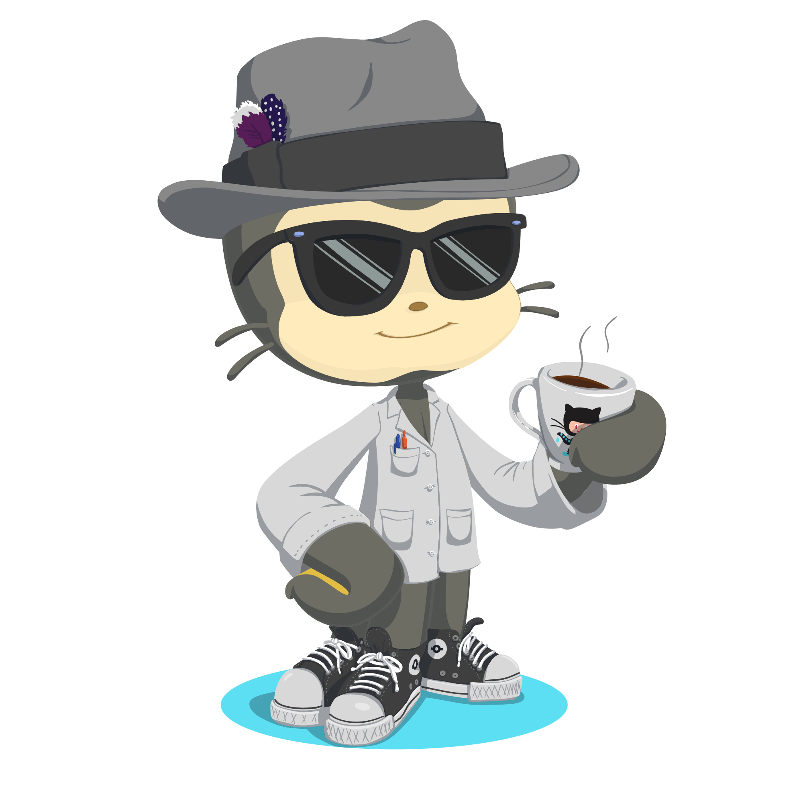

### Hey, I'm Koji 🚀
<div id="badges" align="left">
  <a href="https://www.linkedin.com/in/lucas-furukawa/"></a>
  
</div>



- Shifting from operations to development, blending hands-on experience with technical problem-solving.
- Constantly looking to innovate, improve and expand my knowledge in the tech field, focusing on efficiency and creativity in back-end development

<br>
<br>
<hr>
<h3> 👨‍💻 Software Engineer and Versatile Developer </h3>
Human Coder passionate about solving problems and creating innovations.
<hr>

  ```json
  {
    "phone": "+5️⃣5️⃣ (2️⃣1️⃣ 9️⃣7️⃣0️⃣0️⃣4️⃣-0️⃣8️⃣9️⃣4️⃣)", // Workaround to prevent bots
    "email": "furukawa.lucas🍻gmail.com", // you'll might need .replace('🍻', '@')
    "linkedin": "https://www.linkedin.com/in/lucas-furukawa/"
  }
  ```

```js
import Developer from "Lucaskoji";

class AboutMe extends Developer {
  name = "Lucas Koji";
  area = "Back-end Developer";
  job = "Freelancer";
  location = "home";

  education = [
    "Software Engineering (2024 - 2026) - École 42",
    "Bachelor's in Production Engineer (2016 - 2020) - Federal Fluminense University"
  ];
}

class Skills extends Developer {
    languages = [ "C", "C#", "JAVASCRIPT", "PHP", "Python", "VBA" ];
    databases  = [ "MARIADB", "MYSQL", "POSTGRESQL" ];
    frameworks = [ "EXPRESS", "NODE.JS" ];
    data = [ "EXCEL", "POWER BI", "QLIKVIEW" ]
    others = [ "AMAZON WEB SERVICES", "DOCKER" ];
}
```
